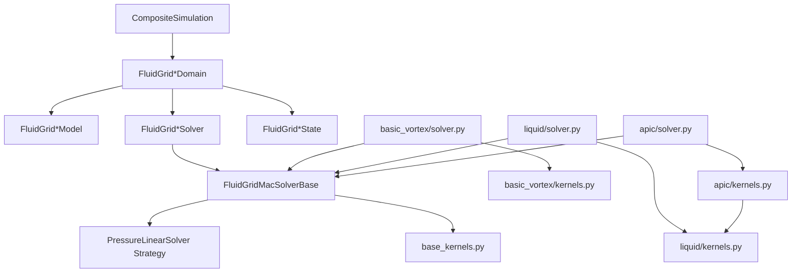
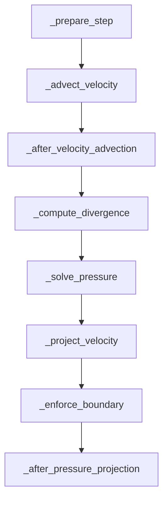
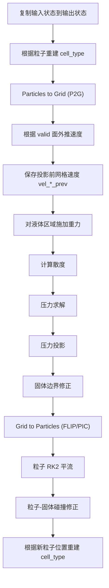

# Fluid Grid 框架开发参考文档

## 1. 文档目的

本文档面向 `wanphys/fluid/fluid_grid` 的维护者和二次开发者，目标是回答下面几类问题：

- 这个子框架的整体分层和职责边界是什么。
- 烟雾、FLIP 液体、APIC 液体三套实现之间如何复用代码。
- 运行一次时间步时，数据如何在 `Model`、`State`、`Solver`、`Domain` 之间流动。
- 每个文件、每个核心类、每类接口分别负责什么。
- 如果要继续扩展一个新的网格流体算法、压力求解器或者边界类型，应该从哪里下手。

本文档尽量贴近当前代码实现，而不是抽象地讲流体算法教科书内容。

---

## 2. 模块定位与总体结论

`fluid_grid` 是 WanPhys 流体团队内部的一个“网格流体算法族”目录，当前包含三类实现：

- `basic_vortex/`
  面向烟雾/气体的 MAC 网格欧拉求解器，带涡量约束和标量密度平流。
- `liquid/`
  基于粒子追踪自由液面的 FLIP 液体求解器，使用 MAC 网格做不可压投影。
- `apic/`
  基于 APIC 传输的液体求解器，本质上是在 `liquid/` 的基础上替换了粒子-网格速度传输方式。

这三者不是完全平行的三套独立系统，而是分成了三层：

1. 共享抽象层
   `base.py`、`pressure_solver.py`
2. 共享数值 kernel 层
   `base_kernels.py`，以及液体专用但可复用的 `liquid/kernels.py`
3. 具体算法层
   `basic_vortex/`、`liquid/`、`apic/`

其中最重要的架构事实有两个：

- `FluidGridMacSolverBase` 提供了一个“标准 MAC 网格求解骨架”，比较适合烟雾类欧拉求解器。
- `liquid` 和 `apic` 虽然也继承 `FluidGridMacSolverBase`，但它们都重写了 `step()`，实际走的是“粒子驱动液体管线”，只复用了压力求解和辅助缓存，不再使用基类的统一 Hook 流程。

换句话说，当前代码已经自然分裂成两条架构支线：

- 烟雾支线：`basic_vortex`，偏 Eulerian，适合继续沿用 `FluidGridMacSolverBase.step()`
- 液体支线：`liquid`/`apic`，偏 Hybrid Particle-Grid，适合复用液体框架继续扩展

---

## 3. 目录结构与文件职责

```text
wanphys/fluid/fluid_grid/
├─ __init__.py
├─ base.py
├─ base_kernels.py
├─ pressure_solver.py
├─ basic_vortex/
│  ├─ __init__.py
│  ├─ domain.py
│  ├─ model.py
│  ├─ state.py
│  ├─ solver.py
│  └─ kernels.py
├─ liquid/
│  ├─ __init__.py
│  ├─ domain.py
│  ├─ model.py
│  ├─ state.py
│  ├─ solver.py
│  └─ kernels.py
└─ apic/
   ├─ __init__.py
   ├─ domain.py
   ├─ model.py
   ├─ state.py
   ├─ solver.py
   └─ kernels.py
```

### 3.1 顶层文件

#### `base.py`

共享抽象层，定义了：

- `FluidGridModelBase`
  共享模型配置和压力求解器配置。
- `FluidGridStateBase`
  共享网格状态，包括 MAC 速度场、压力、密度、固体 SDF。
- `FluidGridSolverBase`
  流体网格求解器抽象接口。
- `FluidGridMacSolverBase`
  基于 MAC 网格的标准求解骨架，以及对压力求解策略的统一接入。

#### `base_kernels.py`

共享数值 kernel 层，主要提供：

- MAC 速度/标量平流
- 常量体力施加
- 固体 SDF 烘焙
- 固体边界速度清零
- 考虑固体边界的散度、压力迭代、投影、线性算子、对角预条件构造

这些 kernel 是烟雾求解器的主要底座，也被液体/APIC 部分复用。

#### `pressure_solver.py`

压力线性系统求解策略层，当前提供：

- `JacobiPressureSolver`
- `PcgPressureSolver`
- `MgpcgPressureSolver`
- `build_pressure_solver()`

这里采用的是策略模式：具体算法不直接写死在各个 solver 中，而是通过 `FluidGridMacSolverBase` 提供的抽象 kernel 接口接入。

#### `__init__.py`

顶层导出入口，导出：

- 共享基类
- 压力求解器策略
- 烟雾 `basic_vortex`
- FLIP 液体 `liquid`

注意：当前 `apic` 没有被这个顶层 `__init__.py` 再导出，使用时需要从子模块显式导入：

```python
from wanphys.fluid.fluid_grid.apic import FluidGridApicModel, FluidGridApicSolver
```

---

## 4. 与 WanPhys Core 的关系

`fluid_grid` 不是孤立执行的，它遵循 WanPhys Core 的统一 `Domain` 抽象。

### 4.1 统一抽象

来自 `wanphys/core/domain.py` 的核心协议为：

- `DomainModel`
  静态配置
- `DomainState`
  运行时状态
- `DomainSolver`
  单步推进
- `Domain`
  对上层暴露的完整物理域

因此每个子算法目录都包含四个核心文件：

- `model.py`
- `state.py`
- `solver.py`
- `domain.py`

### 4.2 CompositeSimulation 中的运行方式

`wanphys/core/composite.py` 中的 `CompositeSimulation` 使用双缓冲状态：

- `_states_in`
  当前步读状态
- `_states_out`
  当前步写状态

单步流程是：

1. `state.clear_forces()`
2. `domain.pre_step(state, dt)`
3. 外部力回调
4. 域间耦合
5. `domain.step(state_in, state_out, dt)`
6. 交换 `in/out`
7. `domain.post_step(state, dt)`

对 `fluid_grid` 来说，这意味着：

- `Domain` 层只负责把 `step()` 转发给具体 solver。
- 真正的数值流程都在 `solver.py` 中。
- 状态对象必须适应双缓冲语义，即每一步都要明确哪些数组是从 `state_in` 读、哪些写入 `state_out`。

---

## 5. 总体架构图



这个图说明了两个关键点：

- 压力求解器是横切能力，由所有 MAC 网格求解器共享。
- APIC 不是另起炉灶，而是在液体模块上再包一层“粒子传输差异”。

---

## 6. 共享基础层详解

## 6.1 `FluidGridModelBase`

`FluidGridModelBase` 是一个 dataclass，承担“共享配置容器”的职责。

### 关键字段

| 字段 | 含义 | 备注 |
| --- | --- | --- |
| `fluid_grid_res` | 网格分辨率 `(nx, ny, nz)` | 当前默认值写成浮点 tuple，但实际使用时会转成 `int` |
| `fluid_grid_cell_size` | 单元尺寸 `dh` | 世界空间网格尺寸 |
| `pressure_iteration` | Jacobi 迭代次数 | 只对 Jacobi 生效 |
| `pressure_solver` | 压力求解方法 | `"jacobi"` / `"pcg"` / `"mgpcg"` |
| `pcg_max_iterations` | PCG 最大迭代次数 | 对 PCG / MGPCG 生效 |
| `pcg_tolerance` | PCG 容差 | 仅在启用残差检查时使用 |
| `pcg_check_interval` | 残差检查频率 | `0` 表示不做中途 CPU 同步检查 |
| `mgpcg_smoother_iterations` | MGPCG 预平滑次数 | MGPCG 预条件器参数 |
| `mgpcg_coarse_iterations` | MGPCG 粗层平滑次数 | 当前实现是近似 coarse sweep |
| `device` | 用户指定的 Warp 设备 | 为空时自动取默认设备 |

### 派生属性

模型基类还提供了便捷属性：

- `resolution`
- `cell_size`
- `nx`
- `ny`
- `nz`
- `dh`
- `pressure_iter`

### 设计定位

这个类只负责“静态配置”，不应该承载运行时数组、临时缓冲或者每步变化的变量。

建议后续扩展时也遵守这个边界：

- 可放入 model：分辨率、数值参数、粒子数、混合系数、迭代次数
- 不应放入 model：速度场、SDF、粒子位置、valid mask、临时 residual buffer

---

## 6.2 `FluidGridStateBase`

`FluidGridStateBase` 是所有网格流体状态的共同父类，持有 GPU 上的基础数组。

### 基础数组

| 成员 | 形状 | 语义 |
| --- | --- | --- |
| `vel_u` | `(nx + 1, ny, nz)` | x 方向面心速度 |
| `vel_v` | `(nx, ny + 1, nz)` | y 方向面心速度 |
| `vel_w` | `(nx, ny, nz + 1)` | z 方向面心速度 |
| `pressure` | `(nx, ny, nz)` | 单元中心压力 |
| `density` | `(nx, ny, nz)` | 单元中心标量场；在烟雾实现中表示烟雾密度 |
| `solid_phi` | `(nx, ny, nz)` | 固体 SDF，约定为“固体内部为负，外部为正” |

### 状态方法

- `clear()`
  清空速度、压力、密度，并把 `solid_phi` 重置为大正数。
- `clone()`
  深拷贝基础数组，返回一个新的 `FluidGridStateBase`。

### 数据语义

#### MAC 速度布局

这是整个框架的核心约定：

- `u(i,j,k)` 位于单元 x-face
- `v(i,j,k)` 位于单元 y-face
- `w(i,j,k)` 位于单元 z-face

因此采样、平流、散度和投影都必须遵守 staggered grid 布局。

#### `solid_phi`

`solid_phi` 表示固体障碍物的 SDF：

- `< 0`：点在固体内部
- `> 0`：点在固体外部

很多边界 kernel 都直接依赖这个符号约定。

### 当前实现注意点

当前代码里有两个值得维护者注意的事实：

1. `FluidGridStateBase` 目前没有实现 `clear_forces()`
   但 `CompositeSimulation.step()` 会调用 `state.clear_forces()`。如果要把 `fluid_grid` 统一挂入组合仿真，建议补齐这一接口，或者明确约定 `clear_forces()` 映射为 `clear()`/空操作。
2. `clone()` 只复制了基类字段
   `liquid` 和 `apic` 子类额外增加的 `cell_type`、`particle_q`、`particle_v`、`particle_c` 并不会被 `FluidGridStateBase.clone()` 复制。后续若要正式使用 `clone()`，子类应覆写。

---

## 6.3 `FluidGridSolverBase`

这是一个非常薄的抽象接口，只规定：

```python
step(state_in, state_out, dt, contacts=None, control=None)
```

它的作用主要是：

- 和 `DomainSolver` 协议对齐
- 给所有网格流体 solver 一个统一类型
- 预留与其他域耦合时可能出现的 `contacts`/`control` 扩展参数

---

## 6.4 `FluidGridMacSolverBase`

这是共享架构里最重要的类。

### 共享缓存

它在构造时分配：

- `div_array`
  当前压力求解所需的散度右端项
- `u_aux` / `v_aux` / `w_aux`
  速度平流或外推时使用的辅助 face buffer
- `_pressure_solver_impl`
  当前压力求解策略对象

### 标准单步流程

`FluidGridMacSolverBase.step()` 实现了一个标准 MAC 网格流程：



这个流程非常适合烟雾一类“速度场 + 标量场”的欧拉求解器。

### Hook 设计

可被子类覆写的接口有两类。

#### 时序 Hook

- `_prepare_step()`
- `_after_velocity_advection()`
- `_after_pressure_projection()`

其中 `_prepare_step()` 和 `_after_velocity_advection()` 默认空实现，供子类插入额外算子。

#### 数值核心 Hook

这些必须由子类实现：

- `_velocity_advect_kernels()`
- `_compute_divergence()`
- `_pressure_kernel()`
- `_pressure_iteration_inputs()`
- `_pressure_apply_operator_kernel()`
- `_pressure_apply_operator_inputs()`
- `_pressure_build_inv_diag_kernel()`
- `_pressure_build_inv_diag_inputs()`
- `_project_velocity()`
- `_enforce_boundary()`

本质上，基类负责组织“时序”和“控制流”，具体 PDE 离散形式由子类通过 kernel 注入。

### 压力求解策略切换

`_solve_pressure()` 内部会读取 `model.pressure_solver`。如果运行期间这个字符串变了，会自动重建 solver strategy。

因此下面两种方式都成立：

```python
model.pressure_solver = "pcg"
```

或者：

```python
solver.set_pressure_solver("mgpcg")
```

这个设计让“数值算法切换”和“主流程代码”解耦，便于后续做 benchmark 或参数扫描。

### 结构边界

`FluidGridMacSolverBase` 更像一个“共享调度器 + 共享缓存持有者”，而不是“完整算法本体”。

建议后续扩展时保持这个边界：

- 共享调度放在基类
- 具体物理公式放在各变体的 `kernels.py`
- 变体特有缓存放在变体 `solver.py`

---

## 6.5 `base_kernels.py`

`base_kernels.py` 可以按职责划分为五组。

### A. 采样与平流

- `sample_scalar_trilinear()`
- `sample_velocity_mac()`
- `advect_u_mac()`
- `advect_v_mac()`
- `advect_w_mac()`
- `advect_scalar_mac()`

作用：

- 基于半拉格朗日回溯进行速度场和平流标量更新
- 统一了 MAC 网格的采样坐标偏移

### B. 外力与耗散

- `apply_force_mac()`
- `dissipate_scalar()`

作用：

- 对某个方向的 face velocity 施加常量力
- 对标量场执行线性衰减

### C. 固体几何烘焙

- `bake_solid_box_kernel()`
- `bake_solid_sphere_kernel()`
- `bake_solid_mesh_kernel()`

作用：

- 把解析几何或网格障碍物烘焙为 cell-centered `solid_phi`
- 多个障碍物通过 `min()` 融合为一个 union SDF

### D. 固体边界条件

- `enforce_solid_u_mac()`
- `enforce_solid_v_mac()`
- `enforce_solid_w_mac()`
- `divergence_cell_with_solid_bc()`

作用：

- 将固体切面的法向速度置零
- 在散度计算时，把贴着固体的面视作不可流通

### E. 压力系统离散

- `compute_divergence_solid_mac()`
- `pressure_jacobi_solid_mac()`
- `project_u_solid_mac()`
- `project_v_solid_mac()`
- `project_w_solid_mac()`
- `pressure_apply_operator_solid_mac()`
- `pressure_build_inv_diag_solid_mac()`

作用：

- 为“带固体障碍边界的不可压投影”提供完整的矩阵自由离散
- 其中：
  - `pressure_jacobi_*` 用于 Jacobi 迭代
  - `pressure_apply_operator_*` 用于 PCG/MGPCG 的 `A x`
  - `pressure_build_inv_diag_*` 用于构造对角预条件器

---

## 7. 压力求解策略层详解

`pressure_solver.py` 是当前共享层中工程质量最高、分层最清晰的一部分。

## 7.1 设计思想

它把“压力线性系统如何求解”从具体物理域里拆出来，形成一个策略接口：

```python
class PressureLinearSolver(ABC):
    def solve(self, solver, state_in, state_out, dt): ...
```

其中：

- `solver`
  是具体流体 solver，本身负责提供离散 kernel
- `PressureLinearSolver`
  只负责组织迭代过程和内部缓冲

这个设计比“每个子模块自己写一套 Jacobi/PCG”更容易维护。

## 7.2 三种实现

### `JacobiPressureSolver`

职责：

- 分配一个辅助压力场 `_pressure_aux`
- 通过 `solver._pressure_kernel()` 和 `solver._pressure_iteration_inputs()` 执行多轮 Jacobi

特点：

- 结构简单
- 易于调试
- 收敛速度相对慢

### `PcgPressureSolver`

职责：

- 构造右端项 `rhs = -div * dh^2 / dt`
- 用矩阵自由 PCG 迭代求解压力
- 使用对角预条件器

内部缓冲包括：

- `_pressure_rhs`
- `_r`
- `_z`
- `_p`
- `_ap`
- `_inv_diag`
- 若干 device scalar：`_s_rz_old`、`_s_alpha`、`_s_beta` 等

特点：

- 比 Jacobi 更高效
- 通过 device scalar 尽量减少每轮 CPU 同步
- `pcg_check_interval=0` 时会关闭中途残差检查，改为固定迭代次数

### `MgpcgPressureSolver`

职责：

- 复用 PCG 外层
- 把预条件步骤替换为多次 smooth sweep

当前实现并不是严格意义上的全多重网格，而是：

- 外层仍为 PCG
- 预条件器使用多次局部光滑近似

因此更准确地说，它是“MGPCG 风格预条件器”，而不是完整 AMG/GMG 框架。

## 7.3 子类 solver 需要提供什么

要接入 `pressure_solver.py`，具体 fluid solver 至少要能提供：

- 一个 Jacobi kernel
- 一个 `A x` kernel
- 一个逆对角近似构造 kernel
- 与自身状态布局匹配的 kernel 输入列表

这也是为什么烟雾、FLIP、APIC 都能共用同一套压力策略。

---

## 8. 烟雾模块 `basic_vortex/`

## 8.1 目标与定位

`basic_vortex` 是当前最标准、最接近“基类设计初衷”的一个实现。

它的特征是：

- 纯 MAC 网格欧拉更新
- 使用标量 `density` 作为烟雾示踪量
- 使用涡量约束增强细节
- 可以叠加外力和球形障碍物

这是最适合作为“新欧拉网格算法模板”的目录。

## 8.2 文件职责

### `basic_vortex/model.py`

定义 `FluidGridModel`，在基类上增加烟雾专用配置：

- `buoyancy`
- `vorticity_scale`
- `damping`
- `dissipation_rate`

其中当前代码实际明确使用的是：

- `vorticity_scale`
- `dissipation_rate`

`buoyancy` 和 `damping` 目前是配置占位，当前 solver 中没有直接使用。

### `basic_vortex/state.py`

定义 `FluidGridState`，目前没有新增字段，完全复用 `FluidGridStateBase`。

### `basic_vortex/domain.py`

定义 `FluidGridDomain`，负责：

- 持有 `model`
- 持有 `solver`
- `create_state()`
- 在 `step()` 中转发给 solver

`name` 固定为：

```python
"fluid_grid"
```

如果放到 `CompositeSimulation` 中，后续应通过这个名字取状态。

### `basic_vortex/kernels.py`

这部分做了两类事情：

1. 直接复用 `base_kernels.py`
2. 新增涡量相关 kernel

主要新增内容：

- `compute_curl_mac()`
- `compute_vorticity_force_mac()`
- `apply_vorticity_u_mac()`
- `apply_vorticity_v_mac()`
- `apply_vorticity_w_mac()`

它还做了一层兼容性别名，把 `base_kernels` 中的固体边界 kernel 重命名为本目录里常用的 `*_mac` 风格名字。

### `basic_vortex/solver.py`

这是烟雾求解器的主实现，真正使用了 `FluidGridMacSolverBase.step()` 的完整时序。

## 8.3 状态与缓存

烟雾 solver 自己额外持有：

- `curl_array`
  cell-centered 涡量向量
- `solid_phi`
  solver 本地的固体 SDF
- `density_aux`
  标量平流辅助缓冲
- `external_force`
  外力累积向量
- `_sphere_center` / `_sphere_radius`
  当前球形障碍物参数

### 一个重要的不对称点

烟雾模块没有使用 `state.solid_phi`，而是把障碍物 SDF 放在了 `solver.solid_phi`。

这和液体/APIC 的设计不同。对维护者来说意味着：

- 烟雾障碍物更像“solver 级静态环境”
- 液体/APIC 障碍物更像“state 的一部分”

如果未来需要统一耦合接口，建议优先考虑把障碍物状态归一到 `state` 层。

## 8.4 单步流程

烟雾 solver 的单步流程是：

```text
1. 速度半拉格朗日平流
2. 施加外力 external_force
3. 施加涡量约束
4. 计算散度
5. 求解压力
6. 压力投影
7. 障碍物边界修正
8. 平流 density
9. 对 density 做耗散
```

其中映射到基类 Hook 为：

- `_velocity_advect_kernels()`
  选择 `advect_u_mac/v_mac/w_mac`
- `_after_velocity_advection()`
  调用 `_apply_force()`、`_apply_vorticity()`
- `_compute_divergence()`
  用固体边界版本散度
- `_after_pressure_projection()`
  负责平流和耗散密度

## 8.5 对外接口

烟雾 solver 当前公开了两个开发常用接口：

### `set_spherical_obstacle(center, radius)`

作用：

- 记录球障碍参数
- 重烘焙 `self.solid_phi`

适用于简单演示或单障碍环境。

### `add_external_force(force)`

作用：

- 将一个 `wp.vec3` 累加到 `external_force`

注意它是“累加型接口”，不是覆盖型接口。

---

## 9. 液体模块 `liquid/`（FLIP）

## 9.1 目标与定位

`liquid` 是一个典型的 Hybrid Particle-Grid 液体求解器：

- 粒子负责表示自由液面和跟踪流体体积
- 网格负责做不可压投影
- 粒子与网格之间通过 FLIP/PIC 混合传输速度

它已经不再遵循“纯欧拉网格一步一步 Hook 进去”的思路，而是显式组织了一条液体专用时间步流程。

## 9.2 文件职责

### `liquid/model.py`

定义 `FluidGridLiquidModel`，增加字段：

| 字段 | 含义 |
| --- | --- |
| `particle_radius` | 粒子重建液面时的半径 |
| `extrap_iterations` | 速度外推迭代次数 |
| `density` | 液体密度参数 |
| `particle_count` | 粒子总数 |
| `flip_pic_blend` | PIC 与 FLIP 混合比 |

当前代码中：

- `particle_radius`
- `extrap_iterations`
- `particle_count`
- `flip_pic_blend`

被明确使用；

`density` 当前没有参与数值计算。

### `liquid/state.py`

在基础状态上新增：

| 成员 | 形状 | 语义 |
| --- | --- | --- |
| `cell_type` | `(nx, ny, nz)` | 0=air, 1=fluid, 2=solid 的占据类型 |
| `particle_q` | `(particle_count,)` | 粒子位置 |
| `particle_v` | `(particle_count,)` | 粒子速度 |

### `liquid/domain.py`

定义 `FluidGridLiquidDomain`，`name` 为：

```python
"fluid_grid_liquid"
```

### `liquid/kernels.py`

这是液体模块最核心的数值文件，职责包括：

- 从粒子重建 `cell_type` / `density`
- 粒子到网格速度转移 `p2g_velocity_*`
- 速度归一化与 valid 标记构建
- 从 valid 面向外迭代外推速度
- FLIP/PIC 粒子速度更新
- 粒子 RK2 平流
- 粒子与固体 SDF 碰撞修正
- 只对液体区域生效的重力
- 考虑空气自由面的压力边界离散

### `liquid/solver.py`

FLIP 主求解器，虽然继承自 `FluidGridMacSolverBase`，但重写了 `step()`。

## 9.3 求解器持有的缓存

FLIP solver 额外持有：

- `gravity`
  重力向量
- `weight_u/v/w`
  P2G 权重累计
- `solid_weight_u/v/w`
  face 与固体交叠后的可流通权重
- `valid_u/v/w`
  当前 face 是否已有粒子贡献
- `valid_u_aux/v_aux/w_aux`
  外推时的辅助 valid mask
- `vel_u_prev/v_prev/w_prev`
  压力投影前的网格速度，用于 FLIP 增量更新

这些缓存的职责很清晰：

- 网格状态数组归 `state`
- 每步临时或长期辅助数组归 `solver`

这是一个值得保留的工程边界。

## 9.4 FLIP 单步流程

FLIP 当前的单步流程可以概括为：



### 关键步骤解释

#### 1. `state_in -> state_out` 拷贝

在步进开始时复制：

- `solid_phi`
- `particle_q`
- `particle_v`

这是为了保证当前步都在 `state_out` 上原地推进，而 `state_in` 保持只读。

#### 2. `_rebuild_fluid_level_set()`

流程：

- 先根据 `solid_phi` 初始化 `cell_type` 为 AIR/SOLID
- 然后让每个粒子把所在 cell 标记为 FLUID，并累加 `density`

最终得到“粒子到 cell center 距离减半径”的近似液面 level set。

#### 3. `_particles_to_grid()`

主要做四件事：

1. 根据 `solid_phi` 构造 face 可流通系数
2. 清空网格速度和权重
3. 用粒子速度向 `u/v/w` 三套 face 做加权散射
4. 用权重归一化速度，并标记哪些 face 是 valid

#### 4. `_extrapolate_velocity()`

液体自由面外部往往会留下没有粒子覆盖的面速度。为了让后续采样更稳定，这里通过邻域平均对 invalid face 进行多轮外推。

#### 5. `_apply_gravity()`

重力只施加到液体区域附近的 face 上，而不是全场统一加速度。

#### 6. `_compute_divergence()`

只在满足下面条件的 cell 上计算散度：

- `cell_type == CELL_FLUID`
- `solid_phi >= 0`

空气单元和固体单元都不会进入压力系统。

#### 7. `_solve_pressure()` + `_project_velocity()`

这一步复用了基类的压力策略体系，但离散 kernel 来自液体专用 `liquid/kernels.py`，因为液体自由面边界条件与烟雾不同。

#### 8. `_update_particle_velocity()`

FLIP/PIC 更新公式由 `update_particle_velocity_flip_pic()` 实现：

- 先采样新网格速度 `grid_v_new`
- 再采样旧网格速度 `grid_v_old`
- 计算 FLIP 增量 `particle_v + (new - old)`
- 再与 PIC 结果按 `flip_pic_blend` 混合

通常：

- `blend` 越小，越接近纯 FLIP，细节多但更容易噪
- `blend` 越大，越接近 PIC，更稳定但更粘

#### 9. `_advect_particles()`

当前使用：

- 二阶 RK2 网格速度采样
- 边界夹取
- 粒子-固体 SDF 碰撞恢复

## 9.5 液体模块中的边界与自由面处理

液体压力离散相比烟雾多了一层“空气界面修正”。

关键函数：

- `fraction_inside()`
- `air_interface_theta()`
- `get_pressure_neighbor_contribution()`

思想是：

- 如果邻居也是液体单元，按正常压力邻接处理
- 如果邻居是空气单元，视为压力为零的自由面，并通过 `theta` 对跨界面距离做修正

这也是液体 `pressure_jacobi_cell_type_mac()`、`pressure_apply_operator_cell_type_mac()`、`project_u/v/w_cell_type()` 与烟雾版不同的根本原因。

## 9.6 对外接口

液体 solver 当前主要暴露两个障碍物烘焙接口：

### `bake_box(state, center, half_extents)`

把盒子障碍物写入 `state.solid_phi`。

### `bake_mesh(state, mesh, pos, rot, scale)`

把网格障碍物写入 `state.solid_phi`。

支持输入类型包括：

- `wp.Mesh`
- 含 `wp_mesh` 属性的对象
- 含 `mesh` 且内部是 `wp.Mesh` 的对象
- 含 `vertices` / `indices` 的网格对象

这两个接口是构建液体场景时最常用的入口。

---

## 10. APIC 模块 `apic/`

## 10.1 目标与定位

`apic` 可以理解为“在 FLIP 液体骨架上，换掉粒子-网格传输模型的版本”。

它与 `liquid` 的差异非常集中，说明当前代码复用做得比较好：

- 自由面重建复用液体模块
- 压力求解复用液体模块
- 重力、边界、外推复用液体模块
- 只有 P2G/G2P 传输逻辑改成了 APIC

这使得 `apic/` 成为一个很好的“如何基于液体框架做算法变体”的示例。

## 10.2 文件职责

### `apic/model.py`

定义 `FluidGridApicModel`，与 FLIP 模型相似，但没有 `flip_pic_blend`。

### `apic/state.py`

在液体状态基础上再增加一个关键字段：

| 成员 | 形状 | 语义 |
| --- | --- | --- |
| `particle_c` | `(particle_count,)` of `wp.mat33` | 粒子的局部仿射速度矩阵 |

这个矩阵是 APIC 与 FLIP 的核心差异。

### `apic/kernels.py`

它只新增四个 APIC 专用 kernel：

- `p2g_velocity_u_apic()`
- `p2g_velocity_v_apic()`
- `p2g_velocity_w_apic()`
- `update_particle_velocity_apic()`

其他大部分功能直接从 `liquid.kernels` 导入复用。

### `apic/solver.py`

APIC 求解器。整体结构几乎平行于 `FluidGridLiquidSolver`。

## 10.3 APIC 与 FLIP 的核心差别

### P2G：带仿射项的动量散射

在 APIC P2G 中，面速度不是直接用粒子速度 `v`，而是：

```text
v_affine = v + C * (x_face - p)
```

这样能把粒子局部速度梯度也注入网格，减少传统 PIC 的数值耗散。

### G2P：回写粒子速度与仿射矩阵

`update_particle_velocity_apic()` 做两件事：

1. 采样粒子位置处的中心速度，写回 `particle_v`
2. 对网格速度做三方向中心差分，重建局部梯度，写回 `particle_c`

当前实现是一种清晰直接的工程实现，优点是容易读懂和扩展，缺点是每粒子需要多次采样网格速度，成本会高于 FLIP 更新。

## 10.4 APIC 单步流程

APIC 的整体流程与 FLIP 基本一致，只是：

- 不再保存 `vel_*_prev`
- `_update_particle_velocity()` 使用 APIC kernel
- `state` 比 FLIP 多了 `particle_c`

因此开发时可以把 APIC 看作：

> `liquid` 框架 + `particle_c` 状态 + APIC 传输 kernel

---

## 11. 三个子模块的职责对照

| 维度 | `basic_vortex` | `liquid` | `apic` |
| --- | --- | --- | --- |
| 物理对象 | 烟雾/气体 | 自由面液体 | 自由面液体 |
| 表面表示 | 无显式液面，仅有 `density` | 粒子 + `cell_type` | 粒子 + `cell_type` |
| 核心状态 | MAC 速度、压力、密度 | MAC 速度、压力、`cell_type`、粒子 | MAC 速度、压力、`cell_type`、粒子、`particle_c` |
| 主流程 | 基类统一 MAC 流程 | 自定义 FLIP 流程 | 自定义 APIC 流程 |
| 粒子-网格传输 | 无 | FLIP/PIC 混合 | APIC |
| 障碍物存储位置 | `solver.solid_phi` | `state.solid_phi` | `state.solid_phi` |
| 典型扩展方向 | 新烟雾算子、新标量 | 新液体边界、新 FLIP 变体 | 新仿射/MLS 传输 |

---

## 12. 关键接口速查

## 12.1 Domain 层

### `FluidGridDomain`

- `name -> "fluid_grid"`
- `create_state() -> FluidGridState`
- `step(state_in, state_out, dt)`

### `FluidGridLiquidDomain`

- `name -> "fluid_grid_liquid"`
- `create_state() -> FluidGridLiquidState`
- `step(state_in, state_out, dt)`

### `FluidGridApicDomain`

- `name -> "fluid_grid_apic"`
- `create_state() -> FluidGridApicState`
- `step(state_in, state_out, dt)`

## 12.2 Solver 层公共接口

### 所有 `FluidGridMacSolverBase` 子类共享

- `step(state_in, state_out, dt, contacts=None, control=None)`
- `set_pressure_solver(method)`

### 烟雾 solver 额外公开

- `set_spherical_obstacle(center, radius)`
- `add_external_force(force)`

### 液体 / APIC solver 额外公开

- `bake_box(state, center, half_extents)`
- `bake_mesh(state, mesh, pos=..., rot=..., scale=...)`

## 12.3 状态层关键字段

### 所有变体共有

- `vel_u`
- `vel_v`
- `vel_w`
- `pressure`
- `density`
- `solid_phi`

### 液体/APIC 共有

- `cell_type`
- `particle_q`
- `particle_v`

### APIC 专有

- `particle_c`

---

## 13. 示例代码对应的推荐阅读顺序

如果新同事要快速理解当前框架，建议按下面顺序阅读：

1. `wanphys/examples/fluid_grid_basic.py`
   理解烟雾 solver 的最小使用方式
2. `wanphys/fluid/fluid_grid/base.py`
   理解共享抽象和 MAC 骨架
3. `wanphys/fluid/fluid_grid/pressure_solver.py`
   理解压力策略层
4. `wanphys/fluid/fluid_grid/basic_vortex/solver.py`
   看基类 Hook 如何被真实使用
5. `wanphys/examples/fluid_grid_liquid.py`
   理解液体初始化、障碍物烘焙、粒子布置
6. `wanphys/fluid/fluid_grid/liquid/solver.py`
   看 FLIP 主流程
7. `wanphys/fluid/fluid_grid/apic/solver.py`
   看 APIC 相对 FLIP 的最小差异
8. `wanphys/examples/fluid_grid_apic.py`
   看 APIC 在 `CompositeSimulation` 里的完整集成

---

## 14. 扩展开发指南

## 14.1 如果要新增一个“烟雾类”网格算法

推荐做法：

1. 新建一个与 `basic_vortex` 平行的目录
2. `model.py` 继承 `FluidGridModelBase`
3. `state.py` 继承 `FluidGridStateBase`
4. `solver.py` 继承 `FluidGridMacSolverBase`
5. 尽量直接复用基类 `step()`，只覆写 Hook 和数值 kernel

最少需要实现：

- `_velocity_advect_kernels()`
- `_compute_divergence()`
- `_pressure_kernel()`
- `_pressure_iteration_inputs()`
- `_pressure_apply_operator_kernel()`
- `_pressure_apply_operator_inputs()`
- `_pressure_build_inv_diag_kernel()`
- `_pressure_build_inv_diag_inputs()`
- `_project_velocity()`
- `_enforce_boundary()`

如果还需要额外算子，比如：

- 浮力
- 温度
- 燃烧
- 染料

建议优先放入：

- `_after_velocity_advection()`
- `_after_pressure_projection()`

而不是直接重写 `step()`。

## 14.2 如果要新增一个“液体类”算法

如果新算法仍然是：

- 粒子表示液面
- 网格做投影
- 只是粒子-网格传输不同

则更推荐从 `liquid` 或 `apic` 拓展，而不是从 `basic_vortex` 起步。

建议步骤：

1. 复制 `liquid/` 或 `apic/` 作为模板
2. 明确新状态是否需要新增粒子属性
3. 修改 P2G / G2P kernel
4. 尽量复用液体自由面压力离散与碰撞处理

典型例子包括：

- pure PIC
- MLS-MPM 风格 transfer
- RPC/APIC 变体

## 14.3 如果要新增一种压力求解方法

推荐做法：

1. 在 `pressure_solver.py` 中新增一个 `PressureLinearSolver` 子类
2. 只在该策略类内部管理自己的缓存
3. 不要把 solver-specific buffer 回灌到各个变体 `solver.py`
4. 在 `build_pressure_solver()` 中注册方法名和别名

这样可以保证：

- 物理变体与线性求解器解耦
- benchmark 更容易做
- 切换方法时不需要改主流程

## 14.4 如果要新增一种障碍物类型

推荐做法：

1. 在共享层新增通用几何时，优先放 `base_kernels.py`
2. 如果只给液体/APIC 用，也可以放 `liquid/kernels.py`
3. 对外在对应 solver 上封装成 `bake_xxx()` 方法

例如新增胶囊体时：

- 新增 `bake_solid_capsule_kernel()`
- 在液体/APIC solver 中新增 `bake_capsule()`
- 如果烟雾也需要，再决定是否同步加到烟雾 solver

## 14.5 如果要新增状态字段

经验上应遵守：

- 永久、每步都会读写的运行时量放 `state`
- 纯临时缓存放 `solver`

新增字段后别忘了同步考虑：

- 初始化
- `clear()` 行为
- `clone()` 行为
- `step()` 开始时 `state_in -> state_out` 拷贝

这一步非常容易漏，尤其是液体/APIC 双缓冲里新加粒子属性时。

## 14.6 如果要接入 `CompositeSimulation`

建议遵守以下约定：

1. `Domain.name` 保持稳定，不要随意改字符串
2. 场景初始化时，把 `_states_in` 和 `_states_out` 都同步好
3. 障碍物 SDF 如果是初始化后不变，也要记得拷到 out buffer
4. 若状态类要参与统一仿真，建议补齐 `clear_forces()`

液体/APIC 示例里都显式做了“初始状态同步到 out buffer”这一步，这不是多余操作，而是双缓冲框架下的必要初始化。

---

## 15. 推荐的工程化改进方向

下面这些不是“必须立刻修改”的问题，但从软件工程角度看，是值得后续整理的地方。

### 15.1 统一 `solid_phi` 的所有权

当前：

- 烟雾：`solver.solid_phi`
- 液体/APIC：`state.solid_phi`

这会让跨模块扩展时产生认知负担。长期建议统一为：

- 静态场景障碍物写入 `state.solid_phi`
- solver 只保留临时缓存

### 15.2 补齐 `DomainState` 契约

`CompositeSimulation` 依赖 `clear_forces()`，当前 `FluidGridStateBase` 未实现。建议补上，哪怕实现为空操作，也比隐式依赖更稳健。

### 15.3 让 `clone()` 与子类状态一致

当前 `clone()` 只复制基类字段，不适合直接用于液体/APIC。建议子类覆写，或者把 clone 设计成模板方法。

### 15.4 整理顶层导出

当前：

- `wanphys.fluid.fluid_grid.__init__` 未导出 APIC
- `wanphys.fluid.__init__` 也未导出 APIC

导致 APIC 的导入路径与 smoke / liquid 不一致。后续若 APIC 稳定，建议统一导出策略。

### 15.5 清理“已配置但未使用”的参数

目前下列字段更像预留接口：

- `basic_vortex.model.buoyancy`
- `basic_vortex.model.damping`
- `liquid.model.density`
- `apic.model.density`

后续可以在两条路线里二选一：

- 真正接入数值流程
- 或者删掉/注释为保留字段，避免误导使用者

---

## 16. 新人上手建议

如果你是第一次接手这个目录，可以按下面的心智模型理解：

- 先把 `fluid_grid` 看成“共享 MAC 网格框架 + 多个算法插件”
- 再把算法插件分成两类：
  - `basic_vortex`：纯网格烟雾
  - `liquid` / `apic`：粒子+网格液体
- 理解 smoke 与 liquid 的关键分界线：
  - smoke 的主状态是网格
  - liquid/apic 的主状态是粒子，网格主要用于投影和采样

用这个视角读代码，会比“逐文件孤立阅读”更容易建立整体图景。

---

## 17. 总结

`wanphys/fluid/fluid_grid` 当前已经形成了一个清晰的内部小框架：

- `base.py`
  负责统一抽象和共享 MAC 求解骨架
- `pressure_solver.py`
  负责压力线性求解策略
- `basic_vortex`
  代表欧拉烟雾方向
- `liquid`
  代表 FLIP 液体方向
- `apic`
  代表在液体骨架上的 APIC 传输变体

如果后续继续演进，最值得坚持的工程原则是：

- 配置在 model
- 运行时主状态在 state
- 临时缓存和算法调度在 solver
- 通用数值 kernel 放共享层
- 变体差异尽量集中在自己的 `solver.py` 和 `kernels.py`

只要这个边界不乱，后面继续加更多网格流体算法，整体可维护性会比较高。
